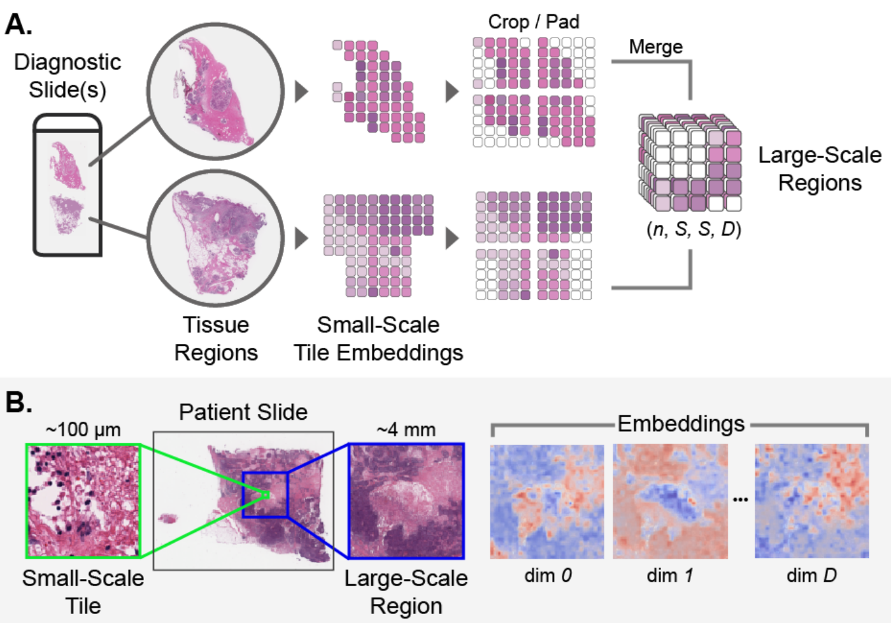
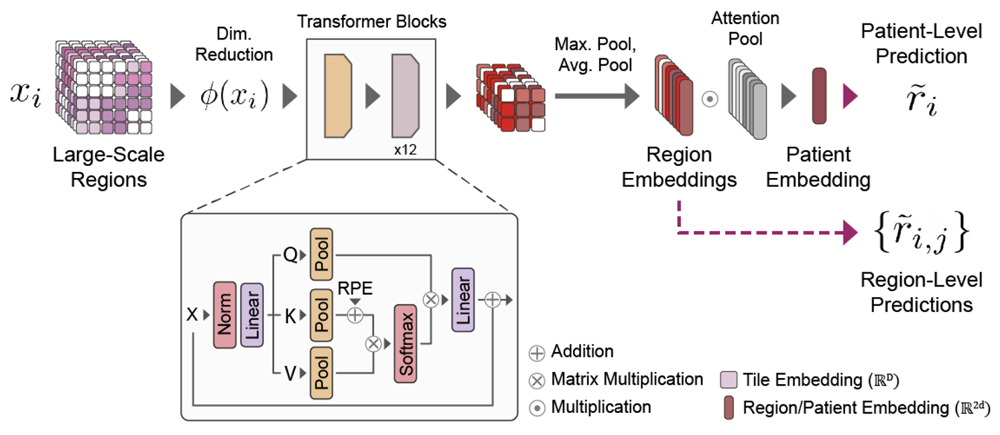
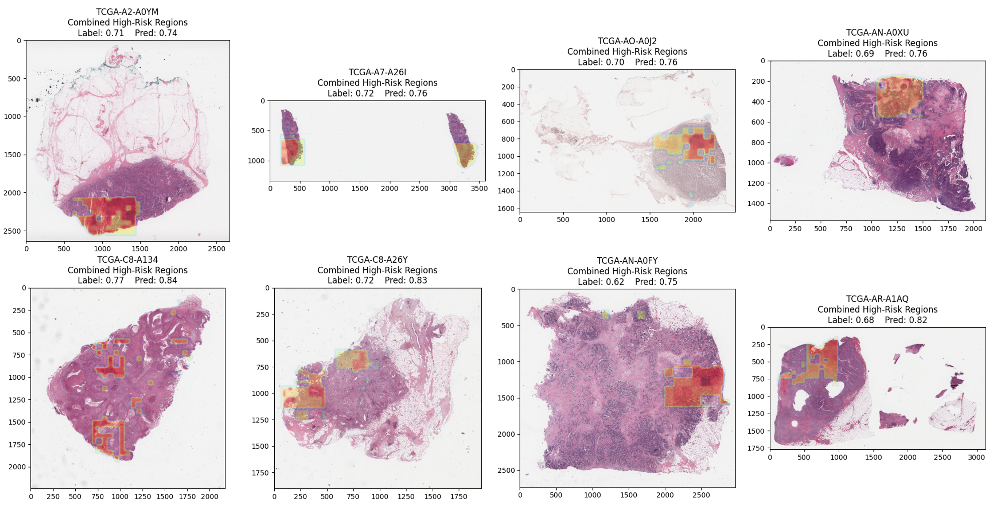

# BRCA RiskFormer

## Project Overview

RiskFormer is a deep learning framework for predicting breast cancer risk from histopathology whole slide images (WSIs) using transformer-based architectures. This project addresses the critical clinical need for more accurate risk prediction models to improve screening and early detection of breast cancer.


Breast cancer risk prediction is essential for early intervention, especially for BRCA1/2 mutation carriers who face elevated lifetime risk (45-87%). While genetic testing approaches like Oncotype DX™ are standard for risk stratification, they remain costly and inaccessible in many settings. RiskFormer leverages deep learning to analyze histopathology images directly, offering a potentially cost-effective alternative that captures tissue-level morphological patterns associated with cancer development.

## Technical Approach

RiskFormer employs a hierarchical architecture specifically designed to handle the extreme size of whole slide images (often exceeding 100,000 × 100,000 pixels) while capturing relevant features at multiple scales:

### 1. **Pre-processing Pipeline**:
Converts gigapixel WSIs into manageable representations through tissue segmentation, patch extraction, and uses pre-trained vision models to extract high-dimensional feature representations from tissue patches.


*Figure 1: Patient Slide Pre-Processing Pipeline. The workflow demonstrates how whole slide images are processed: (A) Tissue regions are isolated and split into smaller image tiles that are embedded using a pre-trained encoder, creating variably sized arrays of tile embeddings that are split/padded into uniformly sized regions. (B) Scale comparison between individual tiles and large-scale tissue regions, showing the dimensional heatmaps for the embeddings.*


### 2. **Hierarchical Transformer Architecture**:
Implements a novel multi-scale transformer designed to handle the complex spatial relationships in whole slide images:

*Figure 2: Risk Prediction Model Architecture. The custom transformer processes patient data as collections of large-scale regions to produce region-level and patient-level risk scores.*

- **Dimensionality Reduction**: phi (φ) to standardize embedding dimensions
- **Multi-Scale Processing**: Deploys specialized transformer blocks with convolution operations to consolidate features spatially.
- **Feature Consolidation**: Concatenates average and maximum region-level pooling of transformed token arrays to capture both typical and salient features
- **Attention Mechanism**: Implements an attention-weighted averaging system where region embeddings receive learned attention weights, enabling the model to focus on the most informative regions
- **Dual Prediction Paths**: Generates both region-level and patient-level risk scores, with the final score derived from attention-weighted embeddings


### 3. **Risk Score Prediction**:
Integrates histopathological features to generate personalized risk predictions on a scale from 0 to 1, which correlate with recurrence risk categories similar to those used in genetic tests like Oncotype DX™.


*Figure 3: Visualizing High-Risk Regions in sample slides. The model combined multiple explainability methods to identify high-risk areas in slides: Tile dropout measures which region occlusions lead to reduced risk, Region-level predictions baked into the architecture of the model, and Attention maps combining transformer block attention weights with region-level attention weights.*

## Implementation

The project is implemented in PyTorch with comprehensive MLOps integration:

- **Distributed Training**: Support for multi-GPU and cloud-based training on AWS
- **Data Pipeline**: Efficient data loading and preprocessing of large whole slide images
- **Model Versioning**: Tracking of experiments and model iterations
- **Containerization**: Docker-based deployment for consistent environments
- **Cloud Integration**: AWS batch processing for scalable inference


### Project Status Disclaimer

**⚠️ Work in Progress:** This repository represents ongoing research work that is being refactored for deployment standards. The codebase is currently transitioning from a research prototype to an implementation ready for production use.

**Current Implementation Status:**
- ✅ Data preprocessing pipeline is implemented and functional
- ✅ Basic AWS infrastructure integration (S3, EC2) is set up
- ✅ Docker containerization is configured
- ✅ Core transformer model architecture is defined
- ⚠️ Training pipeline is partially implemented
- ⚠️ MLOps deployment infrastructure is partially implemented
- ❌ Inference API is not yet implemented
- ❌ CI/CD pipeline is not yet set up

This project demonstrates MLOps practices and AWS cloud integration for large-scale model training and deployment, though some components are still under active development.

### Security Notice

This repository uses AWS infrastructure and requires appropriate credentials for operation. When using this code:

- **Do not** hard-code any AWS credentials directly in the source code
- **Do not** commit `.env` files or credential files to the repository
- **Do** use AWS credential provider chain (environment variables, AWS profiles, or IAM roles)
- **Do** review code for sensitive information before committing

The current implementation passes AWS credentials via environment variables for development purposes. In a production environment, IAM instance profiles should be used instead for better security. All credential handling is done through AWS SDK's secure methods.

## Project Structure

```
brca_riskformer/
│── aws/                # AWS infrastructure components
│   ├── config.json     # AWS configuration
│   ├── lambdas/        # Lambda functions
│   ├── ec2/            # EC2 scripts
│   └── *.sh            # AWS deployment scripts
│── bin/                 # Job execution scripts
│── configs/             # Configuration files
│   ├── aws/            # AWS-related configurations
│   ├── preprocessing/  # Preprocessing configurations
│   ├── training/       # Model training configurations
│   ├── inference/      # Inference configurations
│── entrypoints/        # Main workflow scripts
│── logs/               # Execution logs
│── models/             # Trained model checkpoints
│── notebooks/          # Jupyter notebooks
│   ├── experiments/    # Training experiments
│   ├── testing/        # Debugging notebooks
│── orchestrators/      # Job orchestration scripts
│   ├── batch/          # AWS Batch job definitions
│── resources/          # Static dataset files
│── riskformer/         # Core package
│   ├── data/          # Dataset operations
│   ├── training/      # Training logic
│   ├── utils/         # Utility functions
│── scripts/           # Standalone scripts
│── testing/           # Local testing scripts
│── tests/             # Unit and integration tests
│── docker/            # Docker-related files
│── docs/              # Documentation
```

## Features

- Transformer-based architecture for cancer risk prediction
- Support for processing genetic and clinical data
- AWS Batch integration for scalable processing
- Comprehensive preprocessing pipeline
- Docker containerization for consistent environments
- Extensive testing and documentation

## Installation

1. Clone the repository:
   ```bash
   git clone https://github.com/yourusername/brca-riskformer.git
   cd brca-riskformer
   ```

2. Create and activate a virtual environment:
   ```bash
   python -m venv venv
   source venv/bin/activate  # On Windows: venv\Scripts\activate
   ```

3. Install dependencies:
   ```bash
   pip install -r requirements.txt
   ```

4. Set up environment variables:
   ```bash
   cp .env.example .env
   # Edit .env with your configuration
   ```

## Usage

### Preprocessing

The preprocessing pipeline handles data preparation and feature engineering:

```bash
python entrypoints/preprocess.py --config configs/preprocessing/config.yaml
```

### Training

Train the RiskFormer model:

```bash
python entrypoints/train.py --config configs/training/config.yaml
```

### Inference

Generate predictions using trained models:

```bash
python entrypoints/inference.py --config configs/inference/config.yaml
```

## Development

### Testing

Run tests:
```bash
python -m pytest tests/
```

## Docker

Build the Docker image:
```bash
docker build -t brca-riskformer -f docker/Dockerfile .
```

Run the container:
```bash
docker run -it brca-riskformer
```

## AWS Integration

The project includes AWS integration for scalable processing:

### SQS-Based Job Processing

The project uses AWS SQS for job queue management:

```bash
# Create SQS queue
bash aws/create_sqs_queue.sh
```

### Lambda Functions for Event-Driven Processing

Lambda functions are used to process S3 events:

```bash
# Deploy Lambda function
bash aws/lambdas/deploy_lambda.sh svs_processor
```

### S3 Event Triggers

S3 buckets are configured to trigger Lambda functions:

```bash
# Configure S3 trigger
bash aws/configure_s3_trigger.sh
```

For more details on AWS components, see [aws/README.md](aws/README.md).

## Contributing

1. Fork the repository
2. Create a feature branch
3. Commit your changes
4. Push to the branch
5. Create a Pull Request

## License

This project is licensed under the MIT License - see the [LICENSE](LICENSE) file for details.

## Contact

For questions or issues, please open an issue in the GitHub repository.