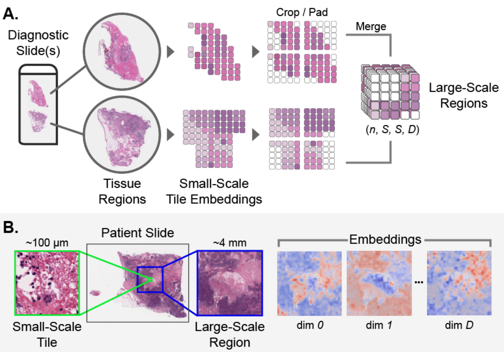
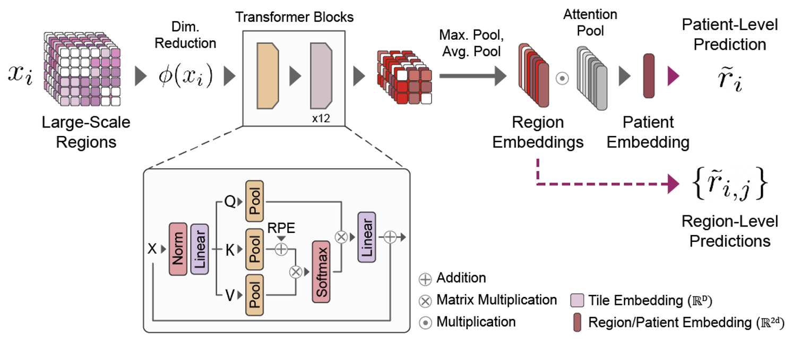
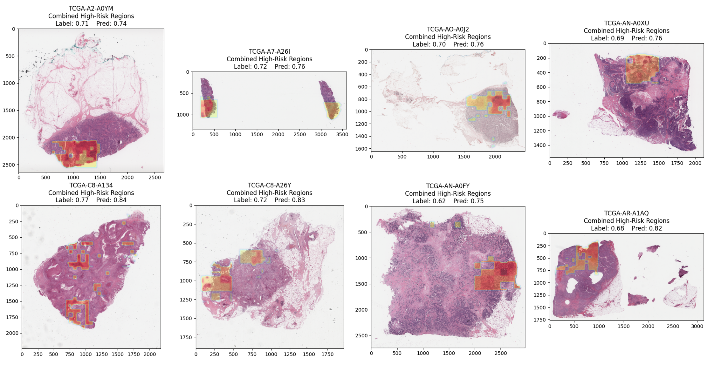

# BRCA RiskFormer

## Project Overview

RiskFormer is a deep learning framework for predicting breast cancer risk from histopathology whole slide images (WSIs) using transformer-based architectures. This project addresses the critical clinical need for more accurate risk prediction models to improve screening and early detection of breast cancer.


Breast cancer risk prediction is essential for early intervention, especially for BRCA1/2 mutation carriers who face elevated lifetime risk (45-87%). While genetic testing approaches like Oncotype DX™ are standard for risk stratification, they remain costly and inaccessible in many settings. RiskFormer leverages deep learning to analyze histopathology images directly, offering a potentially cost-effective alternative that captures tissue-level morphological patterns associated with cancer development.

## Technical Approach

RiskFormer employs a hierarchical architecture specifically designed to handle the extreme size of whole slide images (often exceeding 100,000 × 100,000 pixels) while capturing relevant features at multiple scales:

### 1. **Pre-processing Pipeline**:
Converts gigapixel WSIs into manageable representations through tissue segmentation, patch extraction, and uses pre-trained vision models to extract high-dimensional feature representations from tissue patches.
<div align="center">
  
  <p><em style="font-size: 0.9em;">Figure 1: Patient Slide Pre-Processing Pipeline</em></p>
</div>

The workflow consists of:
- **Tissue Segmentation**: Isolates relevant tissue regions from the slide background
- **Patch Extraction**: Splits identified tissue into smaller image tiles at high resolution
- **Feature Embedding**: Processes tiles through a pre-trained encoder to create variably sized arrays of tile embeddings
- **Region Formatting**: Splits and/or pads the embedding arrays into uniformly sized regions for consistent processing


### 2. **Hierarchical Transformer Architecture**:
Implements a multi-scale transformer designed to handle the complex spatial relationships in whole slide images. Each patient is treated as a batch of "large-scale regions". Each large-scale region is analyzed by a transformer for intra-region analysis, and attention pooling is used to conduct inter-region analysis (between distant large-scale regions in the slide).
<div align="center">
  
  <p><em style="font-size: 0.9em;">Figure 2: Risk Prediction Model Architecture.</em></p>
</div>

The workflow consists of:
- **Dimensionality Reduction**: phi (φ) to standardize embedding dimensions
- **Multi-Scale Processing**: Deploys specialized transformer blocks with convolution operations to consolidate features spatially.
- **Feature Consolidation**: Concatenates average and maximum region-level pooling of transformed token arrays to capture both typical and salient features
- **Attention Mechanism**: Implements an attention-weighted averaging system where region embeddings receive learned attention weights, enabling the model to focus on the most informative regions
- **Dual Prediction Paths**: Generates both region-level and patient-level risk scores, with the final score derived from attention-weighted embeddings


### 3. **Risk Assessment & Visualization**:
The model produces an overall risk prediction on a scale from 0 to 1, which correlates with recurrence risk categories used in genetic tests like Oncotype DX™. 

<div align="center">
  
  <p><em style="font-size: 0.9em;">Figure 3: Visualizing High-Risk Regions in sample slides.</em></p>
</div>

The model also uses multiple explainability methods to identify high-risk areas in slides. These visualization methods include: 
- **Tile dropout**: Measures which region occlusions lead to reduced risk outputs
- **Region-level prediction**: These are sub-slide predictions directly integrated into the architecture of the model
- **Attention maps**: Combines fine-scale transformer block attention weights with region-level attention weights from the attention-pooling step.

## Notebooks

> ⚠️ **Coming Soon**: The following notebooks are under development and will be available in the near future.

The `notebooks/` directory will contain Jupyter notebooks that demonstrate key functionality of the RiskFormer pipeline:

### Dataset Exploration
- **`01_dataset_loading.ipynb`**: Demonstrates how to load and preprocess whole slide images (WSIs) for the RiskFormer pipeline
- **`02_embedding_visualization.ipynb`**: Visualizes tile embeddings and explains their spatial organization

### Model Usage
- **`03_simple_inference.ipynb`**: Step-by-step walkthrough of running inference on new WSIs
- **`04_risk_visualization.ipynb`**: Examples of generating and interpreting risk heatmaps from model outputs

## Implementation

The project is implemented in PyTorch with comprehensive MLOps integration:

- **Distributed Training**: Support for multi-GPU and cloud-based training on AWS leveraging PyTorch Lightning's distributed training capabilities
- **Data Pipeline**: Efficient data loading and preprocessing of large whole slide images with optimized batch processing
- **Model Versioning**: Tracking of experiments and model iterations using Weights & Biases for comprehensive experiment monitoring
- **Containerization**: Docker-based deployment configured with specialized dependencies for histopathology image processing
- **Cloud Integration**: AWS batch processing infrastructure with S3 integration for scalable training and inference


### Project Status Disclaimer

**🚀 Work in Progress:** This repository represents ongoing research work that is being actively developed. The codebase has successfully transitioned from a research prototype to a robust implementation ready for research use.

**Current Implementation Status:**
- ✅ Data preprocessing pipeline is fully implemented with support for whole slide image processing
- ✅ AWS infrastructure integration with S3, EC2 is configured and operational
- ✅ Docker containerization with specialized histopathology dependencies is ready for deployment
- ✅ Core transformer model architecture implemented with multiple transformer variants
- ✅ Training pipeline implemented with PyTorch Lightning with distributed training support
- ✅ Comprehensive experiment tracking and model versioning with Weights & Biases
- ✅ Extensive unit and integration tests covering all core components
- ✅ Orchestration scripts for automated batch processing of slide preprocessing and model training
- 🔄 Advanced explainability methods are being refined for clinical interpretation
- 🔄 Additional model variants are under active development

The codebase is now research-production ready with robust components for the full machine learning lifecycle from data preprocessing to model deployment. Recent updates have focused on optimizing the transformer architecture, improving distributed training performance, and enhancing the reliability of the preprocessing pipeline.

### Project Structure

```
brca_riskformer/
│── configs/             # Configuration files
│   ├── preprocessing/  # Preprocessing configurations
│   ├── training/       # Model training configurations
│── docker/             # Docker-related files
│   ├── Dockerfile      # Container definition
│── docs/               # Documentation and images
│── entrypoints/        # Main workflow scripts
│   ├── preprocess.py   # Preprocessing pipeline
│   ├── train.py        # Model training entry point
│── logs/               # Execution logs
│── lightning_logs/     # PyTorch Lightning logs
│── notebooks/          # Jupyter notebooks
│   ├── experiments/    # Training experiments
│   ├── testing/        # Debugging notebooks
│── orchestrators/      # Job orchestration scripts
│   ├── run_preprocess.py  # Preprocessing orchestration
│   ├── run_train.py      # Training orchestration
│── resources/          # Static dataset files
│── riskformer/         # Core package
│   ├── data/          # Dataset operations
│   │   ├── datasets.py           # Dataset implementations
│   │   └── data_preprocess.py    # Preprocessing utilities
│   ├── training/      # Training logic and model definitions
│   │   ├── model.py              # RiskFormer model implementation
│   │   ├── layers.py             # Custom model layers
│   │   └── train.py              # Training procedures
│   ├── utils/         # Utility functions
│       ├── aws_utils.py          # AWS integration
│       ├── data_utils.py         # Data processing utilities
│       ├── training_utils.py     # Training helpers
│       └── logger_config.py      # Logging configuration
│── scripts/           # Standalone scripts
│── src/               # Legacy source code
│── tests/             # Comprehensive unit and integration tests
│── wandb/             # Weights & Biases logging
│── requirements.txt   # Python dependencies
│── LICENSE            # License file
│── README.md          # This file
```


## Usage

### Preprocessing

The preprocessing pipeline handles data preparation and feature engineering:

```bash
python entrypoints/preprocess.py --input_file <slide_file>.svs --config configs/preprocessing/config.yaml 
```

For batch processing multiple slides:

```bash
python orchestrators/run_preprocess.py --input_dir <slides_directory> --config configs/preprocessing/config.yaml
```

### Training

Train the RiskFormer model with PyTorch Lightning:

```bash
python entrypoints/train.py --config configs/training/config.yaml
```

Or use the orchestrator for distributed training:

```bash
python orchestrators/run_train.py --config configs/training/config.yaml
```

### Development

To set up the development environment:

```bash
pip install -r requirements.txt
```

Run tests with:

```bash
pytest tests/
```

## License

This project is licensed under the MIT License - see the [LICENSE](LICENSE) file for details.

## Contact

For questions or issues, please open an issue in the GitHub repository.